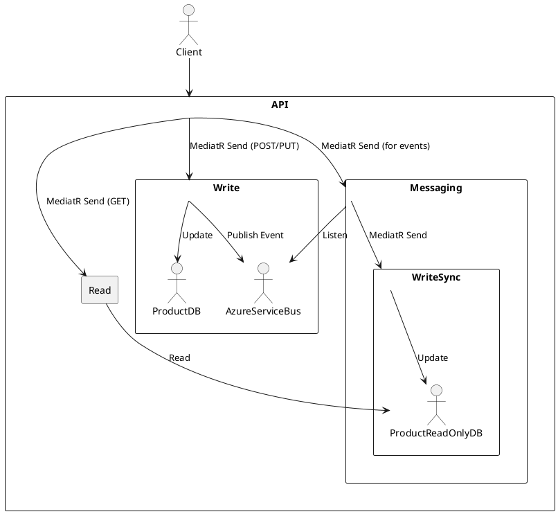

# CQRS With MediatR Sample Application


This repository demonstrates a complete implementation of the **Command Query Responsibility Segregation (CQRS)** pattern in an ASP.NET Core Web API application, designed with microservices architecture principles in mind. It uses **MediatR** for in-process messaging and **Azure Service Bus** for asynchronous, decoupled communication between loosely coupled services or bounded contexts. This enables a scalable, maintainable microservices-oriented architecture where write and read models are completely separated. The application is structured using clean architecture principles, making it highly modular, testable, and scalable.

## 🌐 Overview
This sample application manages products with the following operations:

- Create and update products via HTTP POST/PUT (Write Model)
- Project product changes to a separate read-only view using Azure Service Bus
- Query read-optimized data via HTTP GET (Read Model)

It is designed as a **learning tool** to demonstrate best practices in:

- CQRS with MediatR
- Event-driven architecture with Azure Service Bus
- ASP.NET Core dependency injection
- Azure Key Vault to retrieve secrets (Azure-Service-Bus-Namespace, Azure-Service-Bus-QueueName)
- Clean architecture and project separation
- Optimistic concurrency (RowVersion)

Please reference README-What-Is-CQRS for a description of the Command Query Responsibility Segregation (CQRS) pattern.

---

## 🦯 Architecture Diagram (Text View)
```

           +---------------------------------+
           |           API Gateway           |
           |       ASP.NET Core Web API      |
           +---------------------------------+
             |                             |
        MediatR Send                  MediatR Send
             |                             |
           Write                          Read
             |                             |
+-----------------------+      +-------------------------+
| CqrsWithMediatR.Write |      | CqrsWithMediatR.Read    |
| - Commands/Handlers   |      | - Queries/Handlers      |
| - Product table       |      | - ProductReadOnly table |
+-----------------------+      +-------------------------+
             |
         Messaging
             |
     Azure Service Bus
             |
+---------------------------+
| CqrsWithMediatR.Messaging |
| - ServiceBusConsumer      |
| - ServiceBusPublisher     |
+---------------------------+
             |
        MediatR Send
             |
+---------------------------+
|       WriteSync           |
| CqrsWithMediatR.WriteSync |
| - Sync Commands/Handlers  |
| - ProductReadOnly table   |
+---------------------------+

```

---

## 🖼️ Architecture Diagram (PlantUML)


---

## 📑 Project Structure
```
Solution/
├── CqrsWithMediatR.API             --> ASP.NET Core Web API
├── CqrsWithMediatR.Contracts       --> DTOs and Events
├── CqrsWithMediatR.Write           --> Write model (commands, handlers)
├── CqrsWithMediatR.Read            --> Read model (queries, handlers)
├── CqrsWithMediatR.WriteSync       --> Read-side sync from events
├── CqrsWithMediatR.Messaging       --> Azure Service Bus infrastructure
├── AppDomainEntityFramework        --> Shared EF Core DbContext + Entities
├── CqrsWithMediatR.Configuration   --> KeyVault integration
```

---

## ⚖️ CQRS Workflow

### ✉️ Command Flow
1. Client sends HTTP POST/PUT to create/update a product
2. MediatR dispatches `CreateProductCommand` or `UpdateProductCommand`
3. Handler updates `Product` table
4. Publishes `ProductCreatedEvent` or `ProductUpdatedEvent` to Azure Service Bus

### 📢 Event Propagation
5. `ServiceBusConsumer` receives event
6. Uses MediatR to dispatch a sync command (`SyncProductCreateCommand`, etc.)
7. Handler updates the `ProductReadOnly` table (read projection)

### 📃 Query Flow
8. Client sends HTTP GET to retrieve products
9. MediatR dispatches `GetProductByIdQuery`, etc.
10. Handler reads from `ProductReadOnly` table and returns result

---

## 🧠 Read Model (CqrsWithMediatR.Read)

```
+---------+      +----------------+      +------------------------+     +--------------+
| Client  | ---> | API Controller | --> | MediatR Query Dispatcher| --> | Read Handler |
+---------+      +----------------+      +------------------------+     +--------------+
                                                                               |
                                                                               v
                                                                  +--------------------------+
                                                                  | ProductReadOnly Database |
                                                                  +--------------------------+
```
The **read side** of the application is implemented in the `CqrsWithMediatR.Read` project. It contains the following query objects and MediatR handlers:

**Implemented Queries and Handlers:**
- `GetAllProductsQuery` → `GetAllProductsHandler`
- `GetProductByIdQuery` → `GetProductByIdHandler`
- `GetProductByPriceQuery` → `GetProductByPriceHandler`

Each query is processed via MediatR and returns a projection of the product data from the `ProductReadOnly` table.

**HTTP GET Endpoints:**
```http
GET /api/products                                  --> Returns all products
GET /api/products/1                                --> Returns product by ID
GET /api/products/filter?price=49.99&operation=>=  --> Returns filtered products by price
```

---

## 🧾 Write Model (CqrsWithMediatR.Write)

```
+---------+      +----------------+      +------------------------+    +---------------+
| Client  | ---> | API Controller | --> | MediatR Command Handler| --> | Product Table |
+---------+      +----------------+      +------------------------+    +---------------+
                                                       |
                                                       v
                                          +-------------------------+
                                          | Azure Service Bus Topic |
                                          +-------------------------+
```
The **write side** of the application is implemented in the `CqrsWithMediatR.Write` project. It contains:

**Command Handlers:**
- `CreateProductCommand` → `CreateProductHandler`
- `UpdateProductCommand` → `UpdateProductHandler`

Each command is handled via MediatR and is responsible for writing changes to the `Product` table. These handlers also publish integration events (`ProductCreatedEvent`, `ProductUpdatedEvent`) to Azure Service Bus.

**Database:**
- Writes to `Product` table (primary source of truth)

**Behavior:**
- Enforces optimistic concurrency via `RowVersion`

**Triggered By:**
```http
POST /api/products
PUT /api/products/{id}
```

---

## 🔁 WriteSync Model (CqrsWithMediatR.WriteSync)

```
+-------------------------+     +--------------------+     +-------------------------+
| Azure Service Bus Topic | --> | ServiceBusConsumer | --> | MediatR Sync Dispatcher |
+-------------------------+     +--------------------+     +-------------------------+
                                                                        |
                                                                        v
                                                           +--------------------------+
                                                           | ProductReadOnly Database |
                                                           +--------------------------+

```
The **WriteSync** model is responsible for synchronizing the read model (projections) based on domain events published to Azure Service Bus.

**Handlers and Sync Commands:**
- `SyncProductCreateCommand` → `SyncProductCreateHandler`
- `SyncProductUpdateCommand` → `SyncProductUpdateHandler`

**Triggered By:**
- `ProductCreatedEvent` and `ProductUpdatedEvent` received by `ServiceBusConsumer`

**Database:**
- Updates `ProductReadOnly` table

**Purpose:**
- Keeps read-optimized projections in sync with the authoritative Product data from the write model

- **MediatR** for decoupled command/query dispatch
- **Azure Service Bus** for async event-driven sync
- **EF Core In-Memory DB** for local development/testing
- **Clean separation** between Read and Write models
- **Key Vault integration** for secret management
- **Optimistic Concurrency** with RowVersion (planned for SQL Server)

---

## 📝 Example Queries
```http
POST /api/products
{
  "name": "Gaming Laptop",
  "price": 1299.99
}

PUT /api/products/1
{
  "name": "Updated Name",
  "price": 1399.99,
  "rowVersion": "base64-string"
}

GET /api/products
GET /api/products/1
GET /api/products/filter?price=1000&op=%3E=
```

---

## 🔧 How to Run
1. Clone this repo
2. Create an Azure Service Bus namespace and queue
3. Set required environment variables:
   - `Azure-KeyVault-Url`
   - `Azure-Service-Bus-Namespace`
   - `Azure-Service-Bus-QueueName`
4. Run the API project
5. Use Postman to test the endpoints

---

## 🚀 Future Enhancements
- Add API authentication with JWT
- Replace In-Memory DB with SQL Server
- Add FluentValidation and validation behaviors
- Add unit/integration tests

---

## 📄 License
MIT

---

Feel free to use this as a reference for structuring real-world CQRS applications using MediatR and Azure messaging.


